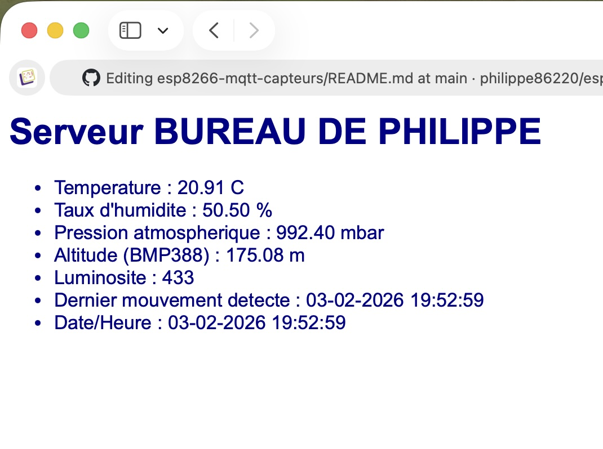
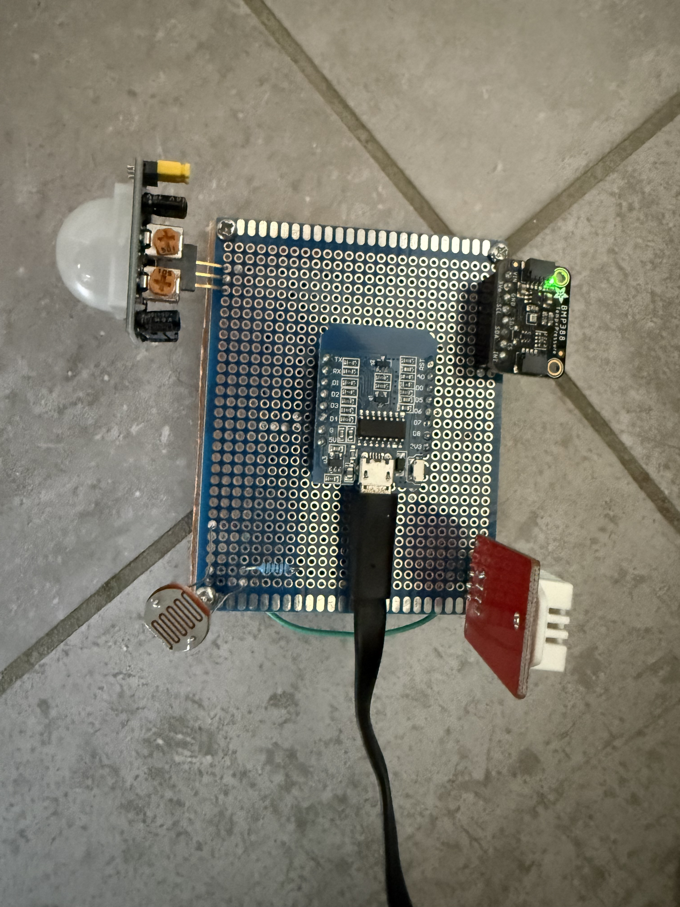
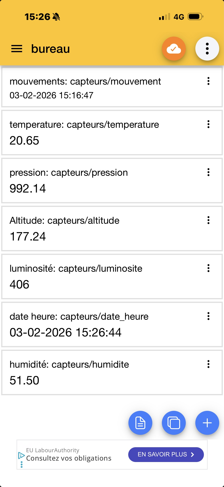

<h1 align="center">ESP8266 — Capteurs, serveur Web et MQTT</h1>

<p align="center">
  
  
  
  
</p>

## Présentation

Ce projet réalise une petite station de capteurs basée sur une **D1 mini (ESP8266)**. Les mesures sont publiées sur un broker MQTT et peuvent être visualisées sur smartphone avec, par exemple, l'application **IoT MQTT Panel**.

La carte relève plusieurs informations dans mon bureau :

- température ;
- humidité ;
- pression atmosphérique ;
- altitude estimée ;
- luminosité ;
- détection de mouvement ;
- date et heure du dernier mouvement détecté.

Les mesures sont accessibles de deux manières :

1. sur une petite page Web hébergée directement par l'ESP8266 et actualisée toutes les deux secondes ;
2. par publication MQTT toutes les secondes vers un broker public.

Ce dépôt me sert avant tout de **mémoire technique personnelle**, afin de retrouver facilement le programme, les bibliothèques nécessaires, les réglages de l'IDE Arduino et les commandes utiles sous Debian.

## Matériel utilisé

- une carte **LOLIN(WEMOS) D1 R2 & mini**, ou clone WeMos D1 mini, équipée d'un ESP8266 ;
- un capteur de température et de pression **BMP388**, relié en I²C ;
- un capteur **DHT22**, utilisé ici pour mesurer l'humidité ;
- une photorésistance **LDR** pour mesurer la luminosité ;
- une résistance de **10 kΩ** pour constituer le pont diviseur de tension de la LDR ;
- un détecteur de mouvement **PIR HC-SR501**, alimenté en 5 V ;
- une breadboard ;
- des fils de connexion ;
- un câble micro-USB permettant l'alimentation **et le transfert des données**.

## Branchement utilisé par le programme

| Élément | Broche D1 mini | GPIO ESP8266 | Rôle |
|---|---:|---:|---|
| DHT22 | D7 | GPIO13 | Données du DHT22 |
| PIR | D6 | GPIO12 | Sortie numérique du détecteur |
| LDR | A0 | ADC0 | Lecture analogique |
| BMP388 SDA | D2 | GPIO4 | Données I²C |
| BMP388 SCL | D1 | GPIO5 | Horloge I²C |

### Alimentation et câblage détaillé

#### BMP388 en I²C

```text
SDA = D2 (GPIO4)
SCL = D1 (GPIO5)
VCC = 3V3
GND = GND
```

#### DHT22

```text
DATA = D7 (GPIO13)
VCC  = 3V3
GND  = GND
```

#### LDR

Le pont diviseur est câblé ainsi :

```text
3V3 → LDR → A0 → résistance 10 kΩ → GND
```

Selon le sens du montage, la valeur analogique peut augmenter ou diminuer lorsque la lumière augmente. Le programme publie la valeur ADC brute, comprise entre 0 et 1023.

#### PIR HC-SR501

```text
OUT = D6 (GPIO12)
VCC = 5V
GND = GND
```

Le HC-SR501 a généralement besoin de quelques secondes de stabilisation après sa mise sous tension.

Le module HC-SR501 est alimenté en **5 V**, mais sa sortie `OUT` délivre normalement un signal logique d’environ **3,3 V**, compatible avec l’entrée D6/GPIO12 de l’ESP8266. Les masses `GND` des deux éléments doivent être reliées.

## Environnement logiciel utilisé

- système : Debian 13 ;
- IDE Arduino : **1.8.19** ;
- cœur ESP8266 : **3.1.2** lors de la dernière compilation ;
- carte sélectionnée : **LOLIN(WEMOS) D1 R2 & mini** ;
- fréquence du processeur : 80 MHz ;
- mémoire Flash : 4 MB ;
- vitesse de téléversement utilisée : **921600 bauds** ;
- moniteur série : 115200 bauds.

## Installer la prise en charge de l'ESP8266

Dans l'IDE Arduino 1.8.19, ouvrir :

```text
Fichier → Préférences
```

Ajouter l'adresse suivante dans **URL de gestionnaire de cartes supplémentaires** :

```text
https://arduino.esp8266.com/stable/package_esp8266com_index.json
```

Ouvrir ensuite :

```text
Outils → Type de carte → Gestionnaire de cartes
```

Rechercher `esp8266`, puis installer :

```text
esp8266 by ESP8266 Community
```

Sélectionner enfin :

```text
Outils → Type de carte → esp8266 → LOLIN(WEMOS) D1 R2 & mini
```
## Bibliothèques

Installer depuis le gestionnaire de bibliothèques de l’IDE Arduino :

- **PubSubClient** par Nick O’Leary ;
- **DHT sensor library** par Adafruit ;
- **Adafruit BMP3XX Library** par Adafruit.

Lorsque l’IDE le propose, accepter l’installation automatique des dépendances.

`ESP8266WebServer.h`, les fonctions Wi-Fi et les fonctions de gestion du temps  
sont déjà fournies par l’environnement ESP8266 installé depuis le gestionnaire  
de cartes. Aucune installation supplémentaire n’est nécessaire.  

Enfin, `secrets.h` n’est pas une bibliothèque : c’est un fichier personnel  
du projet contenant les identifiants Wi-Fi et qui ne doit pas être publié  
sur GitHub.  

## Autoriser l'accès au port série sous Debian

La carte apparaît généralement sous la forme :

```text
/dev/ttyUSB0
```

Le convertisseur USB-série de cette carte est probablement un **CH340**. Son pilote est normalement déjà fourni par le noyau Linux de Debian 13.

Ajouter l'utilisateur courant au groupe `dialout` :

```bash
sudo usermod -aG dialout "$USER"
```

Redémarrer ensuite Debian pour que la nouvelle appartenance au groupe soit active :

```bash
sudo reboot
```

Après le redémarrage, vérifier les groupes actifs :

```bash
id -nG
```

Le groupe `dialout` doit apparaître.

Vérifier le port de la carte :

```bash
ls -l /dev/ttyUSB*
```

Résultat habituel :

```text
crw-rw---- 1 root dialout ... /dev/ttyUSB0
```

Dans l'IDE Arduino, sélectionner alors :

```text
Outils → Port → /dev/ttyUSB0
```

Il ne faut pas utiliser `sudo chmod 777 /dev/ttyUSB0` : cette permission serait trop large et ne survivrait pas au prochain branchement de la carte.

## Configuration Wi-Fi

Le programme d'origine contenait deux constantes semblables à celles-ci :

```cpp
#define ssid     "NOM_DU_RESEAU_WIFI"
#define password "MOT_DE_PASSE_WIFI"
```

Avant de publier un tel programme sur GitHub, pensez à remplacer impérativement les informations réelles par ces valeurs fictives.

j'ai désormais adopté une solution plus propre qui consiste à créer un fichier local `secrets.h` :

```cpp
#pragma once

#define WIFI_SSID     "nom-reel-du-reseau"
#define WIFI_PASSWORD "mot-de-passe-reel"
```

Dans le programme principal :

```cpp
#include "secrets.h"

#define ssid     WIFI_SSID
#define password WIFI_PASSWORD
```

Un fichier public `secrets.example.h`, contenant uniquement des valeurs fictives, montre la structure attendue.

## Configuration MQTT

Le broker actuellement utilisé et fonctionnel est :

```cpp
const char* mqtt_server = "broker.emqx.io";
const int mqtt_port = 1883;
```

Le port 1883 correspond à une connexion MQTT non chiffrée. Le broker est public et doit uniquement servir aux essais : les messages ne sont ni privés ni confidentiels.

Le broker précédemment utilisé dans l'ancienne version du projet était :

```text
test.mosquitto.org:1883
```

Lors du dernier essai, son nom était correctement résolu en adresse IP, mais la connexion au port 1883 expirait. Un test effectué depuis Debian a confirmé le problème :

```bash
nc -vz -w 5 test.mosquitto.org 1883
```

Le broker EMQX a répondu correctement :

```bash
nc -vz -w 5 broker.emqx.io 1883
```

Le résultat se terminait par `1883 open`, avec un code de retour égal à zéro :

```bash
echo $?
```

### Identifiant MQTT

À chaque tentative, le programme construit un identifiant de client presque aléatoire :

```cpp
char clientId[32];
unsigned long r = (unsigned long)random(0xffff);
snprintf(clientId, sizeof(clientId), "ESP8266Client-%04lX", r);
```

Exemple :

```text
ESP8266Client-A42F
```

Le **Client ID** identifie la connexion de l'ESP8266 auprès du broker. Il ne faut pas le confondre avec les sujets MQTT utilisés pour classer les messages.

### Sujets publiés

Le programme publie les mesures sur :

```text
capteurs/temperature
capteurs/humidite
capteurs/pression
capteurs/altitude
capteurs/luminosite
capteurs/date_heure
capteurs/mouvement
```

Ces sujets fonctionnent, mais ils se trouvent sur un broker public. Un préfixe personnel peut être ajouté plus tard pour limiter les risques de collision avec un autre utilisateur :

```text
philippe86220/bureau/capteurs/temperature
```

## Fonctionnement général du programme

### 1. Déclaration des objets principaux

Le programme crée trois objets de communication :

```cpp
WiFiClient espClient;
PubSubClient mqttClient(espClient);
ESP8266WebServer server(80);
```

- `espClient` fournit la connexion réseau TCP ;
- `mqttClient` utilise cette connexion pour communiquer en MQTT ;
- `server` crée un serveur HTTP sur le port 80.

### 2. Initialisation dans `setup()`

La fonction `setup()` est exécutée une seule fois après le démarrage ou le redémarrage de la carte.

Elle effectue successivement les opérations suivantes :

1. ouverture du port série à 115200 bauds ;
2. démarrage du DHT22 ;
3. configuration du PIR comme entrée numérique ;
4. démarrage du bus I²C ;
5. détection et configuration du BMP388 ;
6. connexion au réseau Wi-Fi ;
7. démarrage du serveur Web ;
8. configuration du fuseau horaire Europe/Paris ;
9. synchronisation de l'heure par NTP ;
10. configuration puis connexion au broker MQTT.

Si le BMP388 n'est pas détecté, le programme reste volontairement arrêté dans une boucle :

```cpp
if (!bmp.begin_I2C()) {
  Serial.println("BMP388 KO!");
  while (1) {
    delay(1000);
  }
}
```

### 3. Lecture des capteurs

La fonction `readSensors()` centralise les mesures.

#### BMP388

```cpp
if (bmp.performReading()) {
  t = bmp.temperature;
  p = bmp.pressure / 100.0f;
  a = bmp.readAltitude(SEALEVELPRESSURE_HPA);
}
```

- la température est exprimée en degrés Celsius ;
- la pression fournie en pascals est divisée par 100 pour obtenir des hectopascals, équivalents aux millibars ;
- l'altitude est estimée à partir d'une pression de référence de 1013,25 hPa.

L'altitude reste approximative, car elle varie avec la pression météorologique réelle.

#### DHT22

```cpp
float hh = dht.readHumidity();
if (!isnan(hh)) {
  h = hh;
}
```

La nouvelle humidité remplace l'ancienne uniquement si le DHT22 fournit une valeur valide. Une valeur `NaN` signale une lecture impossible.

#### LDR

```cpp
LecturephotoR = analogRead(photoR);
```

La tension produite par le pont diviseur contenant la photorésistance est convertie en valeur numérique par l'entrée analogique A0.

### 4. Détection de mouvement

À chaque cycle de mesure :

```cpp
pirStatus = (digitalRead(PIR_Out) == HIGH);
if (pirStatus) {
  snprintf(DatePir, sizeof(DatePir), "%s", Maintenant);
}
```

Lorsque le PIR passe à l'état haut, la date et l'heure courantes sont copiées dans `DatePir`. Cette variable conserve ainsi l'heure du dernier mouvement détecté.

### 5. Gestion de la date et de l'heure

La synchronisation NTP utilise :

```cpp
configTime(0, 0, "fr.pool.ntp.org", "pool.ntp.org");
```

Le fuseau Europe/Paris, avec passage automatique entre l'heure d'hiver et l'heure d'été, est configuré par :

```cpp
setenv("TZ", "CET-1CEST,M3.5.0,M10.5.0/3", 1);
tzset();
```

La fonction `formatDateTime()` produit une date sous cette forme :

```text
23-08-2026  15:42:07
```

### 6. Publication MQTT

La fonction `publishMQTT()` convertit les nombres en tableaux de caractères :

```cpp
dtostrf(t, 0, 2, bufTemp);
dtostrf(h, 0, 2, bufHum);
```

Cette conversion est nécessaire car `mqttClient.publish()` reçoit des chaînes de caractères.

Chaque mesure est ensuite envoyée sur son sujet :

```cpp
mqttClient.publish("capteurs/temperature", bufTemp);
mqttClient.publish("capteurs/humidite", bufHum);
```

Les publications utilisent le niveau de service par défaut de `PubSubClient`, soit QoS 0 : le broker ne confirme pas individuellement la réception de chaque message.

### 7. Reconnexion MQTT

La fonction `reconnectMQTT()` tente une connexion tant que le client MQTT n'est pas connecté :

```cpp
while (!mqttClient.connected()) {
  // tentative de connexion
}
```

En cas d'échec, elle affiche le code retourné par `mqttClient.state()`, attend cinq secondes, puis recommence.

Cette méthode est simple, mais elle est **bloquante** : pendant une indisponibilité prolongée du broker, le serveur Web et la lecture des capteurs ne peuvent plus fonctionner normalement. Une évolution future consistera à effectuer les reconnexions sans boucle `while` infinie.

Principaux codes de diagnostic :

| Code | Signification |
|---:|---|
| `-4` | délai de connexion dépassé |
| `-3` | connexion perdue |
| `-2` | connexion TCP impossible |
| `-1` | client déconnecté |
| `1` | version du protocole refusée |
| `2` | identifiant du client refusé |
| `3` | serveur indisponible |
| `4` | identifiants incorrects |
| `5` | connexion non autorisée |

### 8. Serveur Web intégré

La fonction `handleRoot()` construit une page HTML contenant les dernières valeurs connues.

Lorsqu'un navigateur demande la racine `/`, le serveur répond avec :

```cpp
server.send(200, "text/html", page);
```

Pour consulter la page, relever l'adresse affichée dans le moniteur série :

```text
Adresse IP : 192.168.x.x
```

Puis ouvrir cette adresse dans un navigateur connecté au même réseau local :

```text
http://192.168.x.x/
```

### 9. Boucle principale

La fonction `loop()` :

1. traite les requêtes du serveur Web ;
2. vérifie la connexion MQTT ;
3. entretient la communication avec le broker grâce à `mqttClient.loop()` ;
4. met à jour l'heure ;
5. lit les capteurs une fois par seconde ;
6. mémorise l'heure du dernier mouvement ;
7. publie toutes les mesures en MQTT.

La lecture toutes les secondes est adaptée à plusieurs mesures, mais le DHT22 est relativement lent. Une amélioration future pourra limiter sa lecture à une fois toutes les deux secondes.

La page HTML contient actuellement :

```html
<meta http-equiv='refresh' content='2'/>
```

Le navigateur recharge donc automatiquement la page toutes les deux secondes. Ce délai représente un bon compromis entre réactivité et charge imposée à l'ESP8266.

## Dépannage

### Le port `/dev/ttyUSB0` est inaccessible

Vérifier les groupes actifs :

```bash
id -nG
```

Vérifier que la carte est bien détectée :

```bash
ls -l /dev/ttyUSB*
```

Examiner les derniers messages du noyau :

```bash
sudo dmesg | tail -30
```

Fermer le moniteur série avant un téléversement si un programme semble occuper le port.

### Erreur causée par des fichiers `._*`

Des bibliothèques copiées depuis macOS peuvent contenir des fichiers de métadonnées tels que :

```text
._Adafruit_Sensor.cpp
```

Ils ne sont pas de véritables fichiers C++ et peuvent bloquer la compilation.

Les rechercher :

```bash
find ~/Arduino/libraries -type f -name '._*' -print
```

Les placer dans la poubelle :

```bash
find ~/Arduino/libraries -type f -name '._*' -exec gio trash -- {} +
```

### Le programme reste sur « Tentative de connexion MQTT »

Noter le code donné par :

```cpp
mqttClient.state()
```

Tester le port du broker depuis Debian :

```bash
nc -vz -w 5 broker.emqx.io 1883
```

Un résultat contenant `1883 open` signifie que le port est accessible.

## Structure conseillée du dépôt

```text
esp8266-mqtt-capteurs/
├── README.md
├── capteurs_mqtt.ino
├── secrets.example.h
└── docs/
    └── screenshots/
```

## Captures et photographies







## Améliorations possibles

- rendre la reconnexion MQTT non bloquante ;
- espacer les lectures du DHT22 de deux secondes ;
- vérifier le résultat retourné par chaque appel à `mqttClient.publish()` ;
- employer des sujets MQTT personnels ;
- installer un broker Mosquitto personnel sur Terra, éventuellement avec Docker ;
- utiliser une connexion MQTT chiffrée pour un usage autre que des essais ;
- ajouter un schéma précis du câblage ;
- documenter les références exactes du PIR et de la résistance utilisée avec la LDR.

## Usage

Projet personnel destiné à l'apprentissage de l'ESP8266, des capteurs, du protocole MQTT et des serveurs Web embarqués.

## Licence

MIT

## Remerciements

Ce projet a été développé, testé et documenté par Philippe Costes, avec l’aide de ChatGPT (OpenAI) pour l’analyse du code, le dépannage et la rédaction de la documentation.

